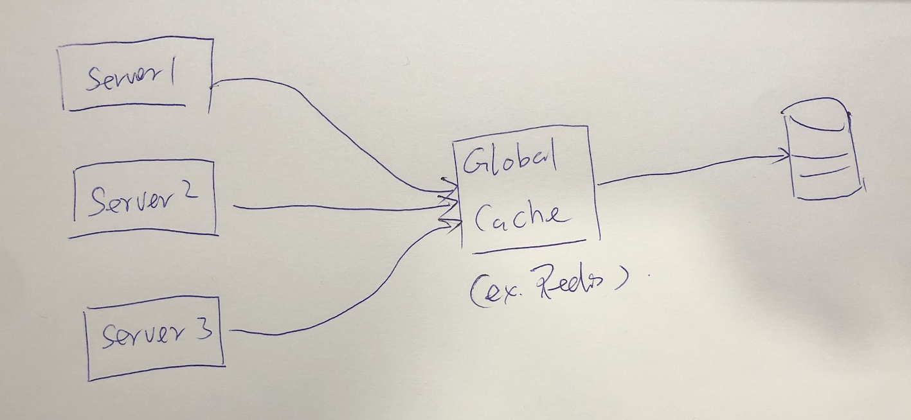

# Caching

## Application server cache
Caching的好处
- 减少网络请求(network calls to DB)
- 减少重复计算(将常用的计算结果存储在Cache中)
- 降低DB负载
- 最终目的是降低系统响应时间，提高用户体验

在分布式系统中，虽然每台机器可以有自己的Cache，但是如果同样的请求被分配到了不同的机器，将会大大降低Cache的命中率。解决单机缓存命中miss的方法有两种
- 全局缓存 Global Cache
    - 如果某台server出现故障，不会影响Cache
    - 可以独立扩展Cache server
    
- 分布式缓存 Distributed Cache
    - 多台Cache server组成集群，每台机器存储部分Cache数据
    - 优点是可以无限Vertical Scaling(加机器)
    - 如果有一个缓存结点挂了，或者增加一个结点，可能导致集群缓存失效 - Consistent Hashing可以解决这一问题
    - ref: https://xta0.me/2016/06/22/System-Design-Cache.html

## CDN
- 存储静态文件：图片，JS，CSS等等
- CDN 分布世界各地，系统会自动从距离用户最近的CDN edge中获取数据
- 如果系统没有大到需要CDN, 可以用子域名+Nginx代替，例如，https://static.domain.com

## 缓存无效(Cache Invalidation)
主要说的是，缓存的数据要跟数据库的数据保持一致，也就是数据一致性(data consistency), 有三种方案
- Write-through cache
    - 数据同时写入Cache和DB
    - 优点是，保证强一致性，减少数据丢失的风险
    - 缺点是，延迟高，因为每次要进行两次数据写入(cache和DB)
    - 适用critical的数据，例如财务信息，交易资料，密码等
- Write-around cache
    - 数据绕过Cache，直接写入DB
    - 下次数据读取时，先读取DB，再更新到Cache
    - 如果写入后立即被读取，会造成Cache miss 或者数据不一致
    - 适用写入或更新后不会被立即读取的数据
- Write-back cache
    - 数据只写入cache，暂时不写入DB， 等一段时间后，例如10s,20s后，批量写入DB
    - 优点是低延迟
    - 缺点是如果Cache crash，会造成数据丢失
    - 适用non critical的数据
