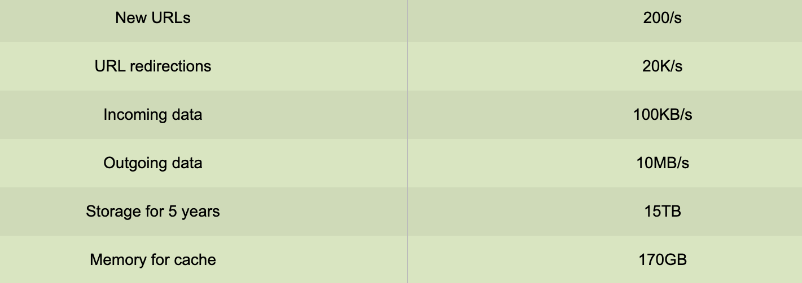
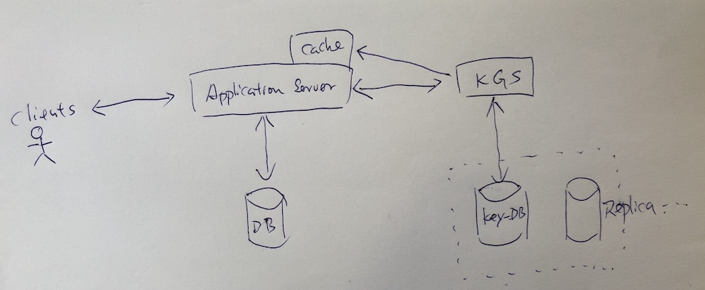
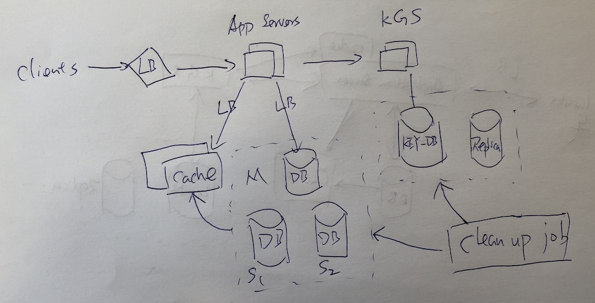

# URL Shortening service

## 明确需求

- 功能性需求
    - 给定一个URL。需要吧URL转换成一个更加短的URL
    - 当用户点击短URL时，系统可以重定向到转换之前的长URL
    - 在转换成短URL时，用户可以选择自定义短URL
    - 短URL有默认的过期时间，用户也应该能够指定到期时间
- 非功能性需求
    - 高可用
    - 低延迟
    - 短URL需随机生成，不可预测
- 延伸需求
    - 分析：重定向发生了多少次
    - Access by RESTFul APIs

## 估算和约束

该系统的Read操作将会很重，有很多重定向的request。所以我们可以假设Read跟Write的比例是100:1
- 流量估算

    假设每个月有500M个新生成的短URL，所以读的请求就是500M * 100 = 50B(500亿)

    QPS(Write) = 500M/(30*24*3600) = ~200URLs/s (每秒200个URL写入)

    QPS(Read) = 200 * 100 = 20k URLs/s (每秒2万个URL读出)

- 存储估算

    假设我们要存储5年内的所有Request。那么一共就是

    500M * 5 years * 12 months = 30B (3 百亿个Object)

    假设每个Object 500 bytes，那么5年一共需要

    500 bytes * 30B = 15TB 的 存储空间

- 带宽估算

    对于Write操作，200URLs/s 每个request 500bytes。

    200 * 500bytes = 100KB/s

    对于Read操作，20KURLs/s

    20K * 500bytes = 10MB/s

- 缓存估算

    如果我们想Cache一些热门的URLs 根据2:8原则，我们应该预测20%的URLs是需要被Cache的

    读操作每天有 20K * 3600 * 24 = ~1.7B 个Request

    每个Request 500bytes

    Cache = 1.7B * 500 bytes * 20% = ~170GB

- 总结

## System APIs

- createURL(api_dev_key, original_url,expire_date,custom_alias,user_name)

    api_dev_key: 给每个用户分配一个key，以便以后控制每个用户可创建URLs的个数

    expire_date,custom_alias,user_name： 可选

- deleteURL(api_dev_key, url_key)

    url_key 代表shorten url

## DB design

因为我们需要存储大量的数据，并且主要以Read为主，并且Table之间很少需要关联，所以NoSQL DB是一个更好的选择，DynamoDB Cassandra，MongoDB等等

主要有两个表， 一个是User，一个是URL

User： UserID(PK)| Name | Email | CreationDate | LastLogin

URL: URLKey(PK) | OriginalURL | CreationDate | ExpirationDate | UserID

## 基础的系统设计和算法

1. 如果生成短URL
    可以使用HASH算法（MD5， SHA256），之后再用Base36或Base62或Base64 Encode
        - MD5 输出 128bit。 SHA输出256bit
        - Base36(a-z,0-9);Base62(A-Z,a-z,0-9);Base64(A-Z,a-z,0-9,+-)

    因为我们要将长URL转换成类似 www.yourdomain.com/ds3Zj3kJ  这样的短链接，但我们用MD5 Hash之后输出128bit，再用Base64 encode(每6位一组) 所以长度是128/6 = ～21位字符。远远长过ds3Zj3kJ。 解决方法是选择21位中的头8位数据，如有重复，就交换或者替换成其他字符

- 另外一个问题是：不同的User输入相同的URL 应该要输出不同的Short URL。解决方法是再Original URL中加入UserID(或者一个递增序列，但容易overflow)。如果用户没有登陆，则需要输入一个Unique Key. 如果生成的Short URL再有重复，则继续Hash。直到不重复为止

2. 离线生成Key

    我们可以用一个Standalone的server去生成KEY (Key Generation Service - KGS). KGS 可以帮我们提前生成大量随机唯一的key并存储在DB。任何时候我们需要Shorten URL。就可以在DB中直接拿走一个KEY，并且标记为“已用”，或者移到另外一个table中，为防止并发线程同时读取同一个KEY，在标记或移动KEY时DB要上锁（Synchronize or lock on）。

    还可以优化的部分是，KGS可以先将一部分的KEY放入memory中，加速读取。但一旦memory crash，KEY就没有了，但是这是可以接受的，KEY可以无限制的生成。

- KEY DB 要多大
    因我们用Base64 生成8位唯一KEY， 所以一共可以生成64^8 = ~281T 个keys。所需的空间位8 * 281T = ~2.2PB 

# DB Partitioning
为防止不平均，所以不用range-base partitioning。 Hash-based paritiong 是一个好的选择。把key对应到【0.。256】分区，如果依然导致某篇分区过载，那么可以适用Consistent Hashing

另外因为Read过多，可以用Master-Slave 模式

## Cache
- 现有的解决方案：Memcached or Redis
- 大小 170GB 之前计算过
- LRU + replica
- 如果有Cache miss，则访问DB，之后再更新Cache

## Load Balancer(LB)

LB 可以放在
- Between client and application server
- Between application server and DB
- Between application server and Cache

可以用不同的分发策略：轮询，最小流量，最小负载等等

## 数据库清理
一旦URL过期，我们需要清理这些URL，并且释放KEY

- 用一个独立的server 去run Cron job，定期去数据库清理，一般在晚上，DB负载比较小的时候进行。
- 将URL删除，并且把KEY 再放入KEY-DB中可再利用

