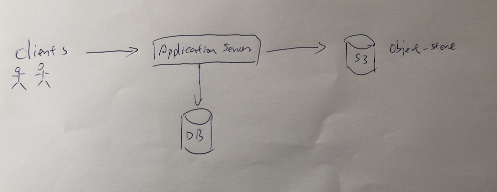
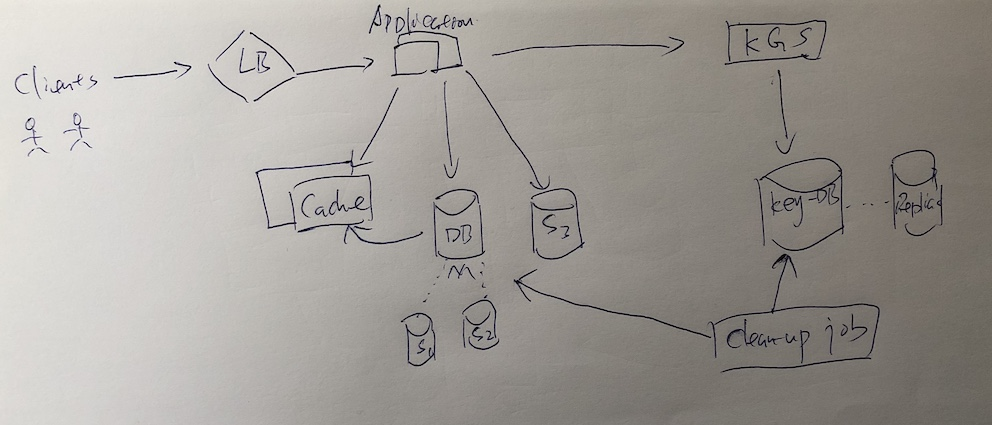

# Pastebin

## 明确需求

- 功能性需求
    - 用户可以上传或者粘贴他们的文本或图片，然后得到一个随机唯一的URL可以访问这些内容
    - 内容或者URL在一段时间过后会过期。用户可以指定过期时间
    - 用户可以自定义URL

- 非功能性需求
    - 高可靠性
    - 高可用
    - 低延迟
    - 唯一的URL必须是随机的

- 延伸需求
    - 每个URL被访问过多少次
    - Access by RESTFull APIs

## 估算和约束
因为这个系统是Read-heavy，所以我们假设读与写的比例是5:1

- 流量估算

    假设每天有100万个写操作，那个读操作是500万

    QPS(Wirte) = 1M/(24*3600) = ~12个/s

    QPS(Read) = 5M/(24*3600) = ~58个/s

- 存储估算
    假设平均每次粘贴的文本大小在10KB左右

    文本：1M * 10KB = 10GB/day 那么10年就需要有10GB * 365 * 10 = 36TB 的容量

    URL：1M * 6(每个URL 用6个字符表示 - 6 bytes ) = 6MB/day, 10年就是 6MB* 365*10 = 22GB

- 带宽估算

    QPS(Write) = 12/s 每个request 大小问10kb，所以带宽为 12*10KB = 120KB/s
    
    QPS(Red) = 58/s， 所以带宽为0.6MB/s

- 缓存估算

    读操作每天有5M，每个大小10KB，将20%的内容放入缓存

    5M * 10KB * 20% = 10GB

## System APIs

- addPaste(api_dev_key, paste_data, custom_url, user_name, paste_name, expiration_date)
- deletePaste(api_dev_key, paste_key)
- getPaster(api_dev_key, paste_key)

## Database Design

User： UserID(PK)| Name | Email | CreationDate | LastLogin

Paste: PasteKey(PK) | PasteDataKey | CreationDate | ExpirationDate | UserID

PasteDataKey指定另一个外部object store

## High Level Design

## Component Design

### Application layer

- 用一个server去离线处理KEY生成的问题，Key Generation Servide(KGS)
- KGS 需要一个replica 避免单点故障
- Application server 可以cache部分可用的key

## Datastore Layer

- Prefer NoSQL DB
- Object store: prefer AWS S3

## DB Cleadnup
## DB partitioning
## Cache and LB

## Final Design

