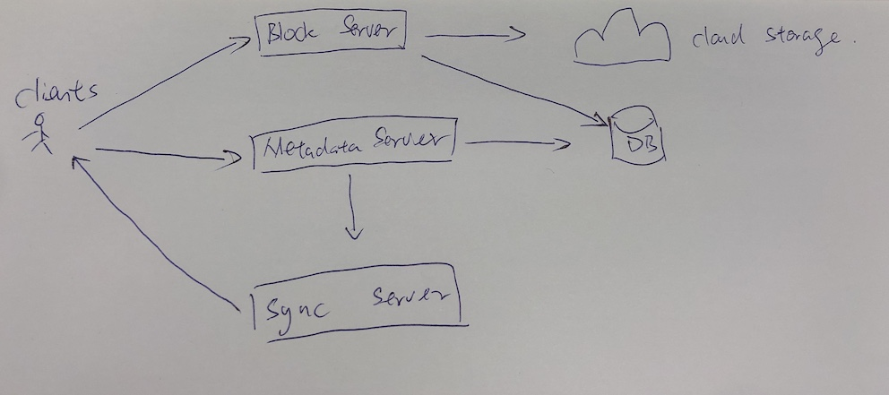
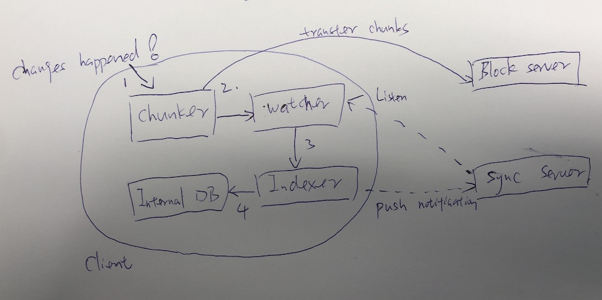
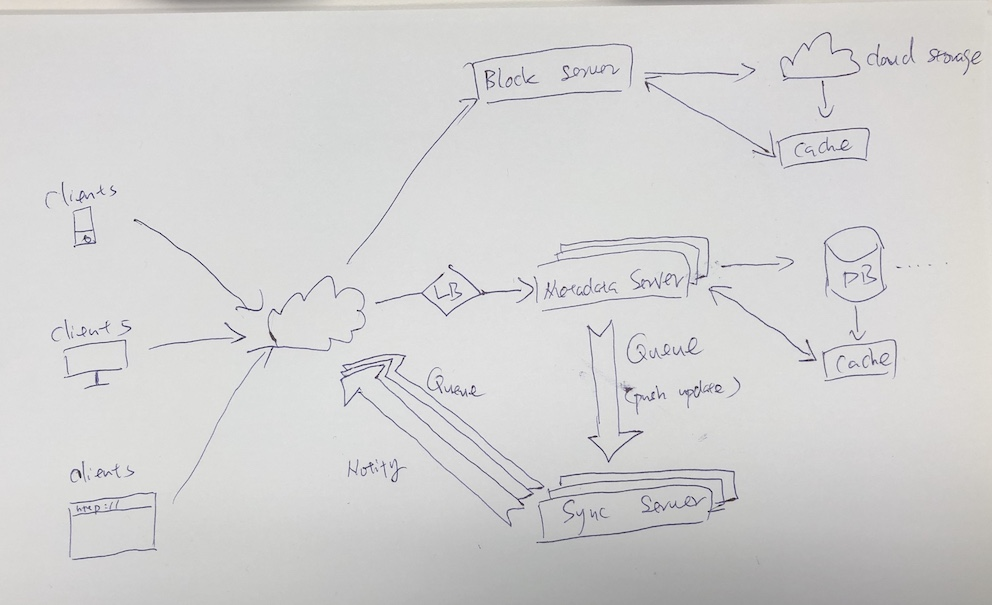

# Dropbox

## Clod Storage 的优势
- 可用性 (Availability): 随时随地，只要可以上网，就可以访问文件
- 可靠性 (Reliability and Durability): 数据不会丢失
- 可扩展性 (Scalability): 不用担心空间不够，只要付费就可以扩容

## 明确需求
- 功能性需求
    - 用户可以上传下载文件或图片
    - 用户可以分享文件或文件夹给其他人
    - 支持大文件上传
    - 上传后，同步所有设备
    - ACID
    - 支持离线编辑，上线后自动更新
- 扩展需求
    - 支持数据快照，以便用户可以回到文件的任意版本

## 设计中的一些注意事项
- 有很大的读与写操作
- 读与写的比例几乎为1:1
- 文件要存储在Small chunk(say 4MB)，这样做的好处是，即便某一个chunk上传或者下载失败，仅需要重试这一小块的内容
- 只传输有更新的chunk
- 删除重复的chunk，节省空间
- 在客户端保留一些文件的元数据，例如文件名，大小等，可节省许多服务器的请求
- 对于一些小的修改，客户款只更新有差异的地方，不用上传整个Chunk

## 估算和约束
- 假设有500M个用户，DAU有100M
- 每个用户有200个文件/照片，每个文件平均100KB
- 一共大小为  500M * 200 * 100KB = 10PB 的存储空间
- 假设一分钟有1M个用户在访问。那个QPS = 1M/60 = ～16.7K /s

## High Level Design
- 我们需要一个server去专门上传下载文件
- 还需要一个server处理保存文件的元数据，比如文件名，，文件打下，目录，分享给谁等等
- 另外需要一个Sync server 去通知用户文件有更新

## 组件设计

### 客户端(Mobile，Website，Desktop)
- 客户端主要功能有
    - 上传或下载文件
    - 检测工作区文件夹中内的文件是否有更改
    - 处理由于Offline或者同步更新导致的冲突

- 如何有效的处理文件传输
    将每个文件分成较小的chunk，以便传输，假设有个chunk大小为4MB。 我们可以基于以下几点来计算最佳的chunk size。 1：云存储设备可优先的空间利用率和IOPS；2:网络带宽；3:平均文件大小。 在元数据中（metadata），我们还应该记录每个文件及其组成的chunk

- 在客户端保存copy of metadata。可以做离线更新，节省request去远程更新metadata，并且省去了每次要去Metadata server获取Metadata，因为文件特别多，所以每次扫描数据库也很不高效

- 客户端如何有效监听文件更改
    如果每隔一段时间去check是够有更新，如果间隔时间比较长，那么会有delay，如果间隔时间很短，那么会浪费大量的网络资源

    所以解决方法为，建立一个HTTP Long polling连接，只有在数据有更新的才返回，没数据的时候就一直在等待

基于以上几点，我们可以将客户端分为4个部分
1. Internal Metadata DB：
    记录所有文件的chunks，versions和位置等信息
2. Chunker
    - 负责将文件分成chunks，也可以将chunks恢复文件。
    - 可以检测到哪一块chunk有更新，只传输有更新的chunk，会大大节省网络带宽和同步的时间
3. Watcher
    - 监视工作区文件夹，一旦有更新（Create，Update，Delete）就通知Indexer
    - 监听Sync server的广播，看是否其他设备有更新
4. Indexer
    - 处理Watcher发来的事件，update interval Metadata DB，一旦文件上传/下载完成，就通知Sync server(应该先通知Metadata server 通知Sync server)广播到其他设备

### Metadata DB

Metadata需要存储以下信息：
1. Chunks
2. Files
3. User
4. Devices
5. Workspace

### Synchronization Service

Sync 服务主要用于
1. 当收到客户端所做的更新时，与Metadata数据库做一致性检查，并将更新广播给其他设备或者订阅的用户
2. 将Metadata DB同步给用户Local DB
3. 当用户离线一段时间后重新上线，请求Sync service for new updates

为了支持大量用户，可以用MQ作为更新传递管道，容易扩展，支持高并发

### MQ Service
- 用户请求更新：将更新传入Queue中，多个Server会consume Queue里面的内容，并更新DB
- 发送更新信息给用户：Sync server将更新信息传入Queue中，每个用户有单独的Queue

Workflow：(A用户更新文件，该文件共享给了B和C)
1. A上传updated chunks
2. A上传更新的metadata头Metadata Server，然后更新DB
3. A收到更新完成的确认，Metadata Server通知Sync Server发送更新给B和C
4. B和C客户端的Watcher收到更新通知，更新Local DB，并下载updated chunks

## 重复数据

- 计算一个文件中每个chunks的hash值，一旦该文件有更新，计算这个文件中哪些chunks的hash值更改了，并只传送更改的chunks。
- 有新的chunks请求更改，计算hash值，并与现有的所有chunks的hash值比较，看是否有重复，有重复的话就不需要传输

上面两种计算和比较可实时完成，优化了网络传输速度和数据存储空间

## Metadata Partitioning

Hash-Based Partitioning: hash(File_ID), 如果某片数据过载或数据极少，可用Consistent Hashing 解决
