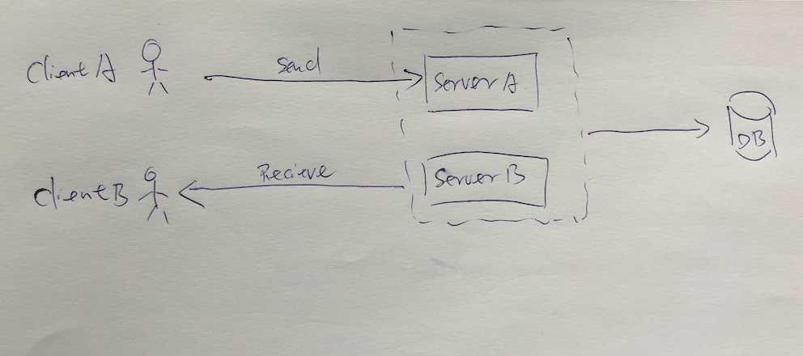
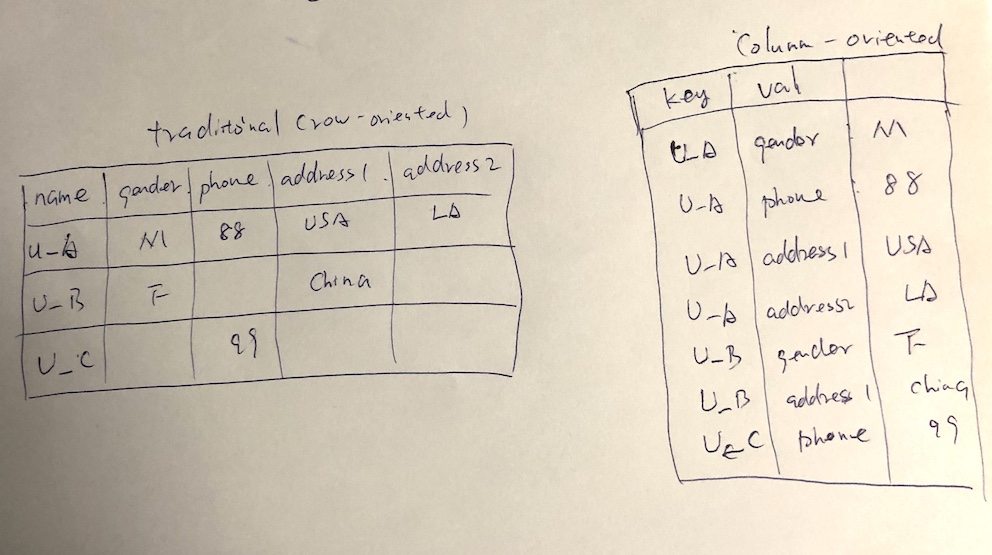
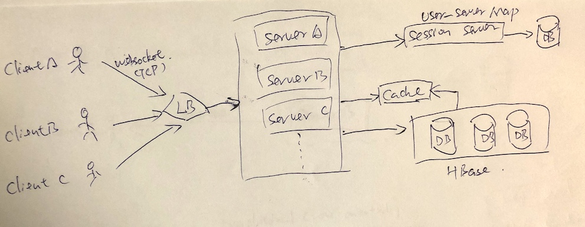
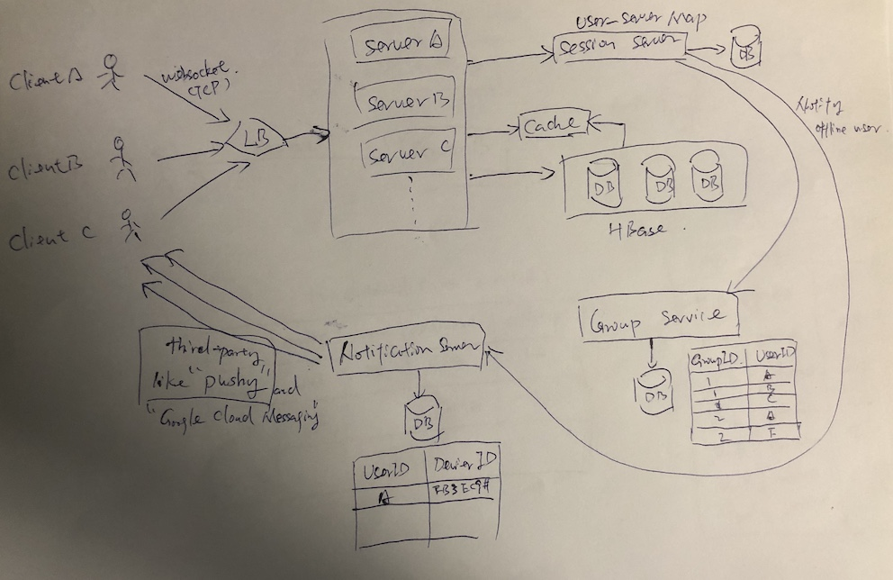

# Facebook Messenger

## 明确需求
- 功能性需求
    - 支持1对1传送消息
    - 支持追踪用户是否在线
    - 支持存储用户聊天记录
- 非功能性需求
    - 实时传送消息，低延迟
    - 消息一致性
    - 高可用
- 扩展需求
    - Group chat
    - 当用户不在线时，推送消息

## 估算和约束
- 流量估算（traffic estimates）

    假设有500M个DAU，每个用户每天发送40条信息

    QPS = 500M * 40 / (24*3600) = ~0.23M r/s

- 存储估算

    假设每条消息100bytes，

    每天的存储量为：500M * 40 * 100 = 2TB/day

    5年的存储量为：2TB * 365 * 5 = ~3.6PB

- 带宽估算
    QPS * 100bytes = 0.23M * 100bytes = 23MB/s

## High Level Design

用户A发消息给用户B

1. 用户A向Server A 发一条信息
2. Server A 向用户A 确认已收到
3. Server A 将信息存入DB，并向连接着用户B的Server B 发送消息
4. Server B 确认收到，并向用户B发消息
5. 用户B 确认消息收到，Server B 确认收到， Server A确认消息收到

## 组件设计

- Messages Handling
    
    - 用户与Server 建立 Websocket或者Long Polling连接，一旦Server收到消息马上发送给用户，没消息的时候就Hold住连接，不发送任何消息。
    - 用hashtable 维护用户与Server的mapping 这个HashTable可以用一个Microservice来查询
    - 如果用户offline：1. 如果是暂时性的，可以retry几次；2. 如果长时间，就将信息存入DB，等下次用户上线再push给用户
    - 需要多少server，假设每个server能handle 50K个并发连接。那么500M个用户就需要10K个Server

- 存取信息from DB

    - 有大量的信息要写
    - 查询时，顺序访问信息
    - HBase
        - 支持海量写入
        - Column-oriented key-value NoSQL DB，可以将一个key的多个值，存入多个列
            
        - HBase模仿Google的Bigtable，建立在Hadoop Distrubuted File System(HDFS)之上,将新的数据写入Memory，当Memory满了在写入Disk
        - 可以用key扫描多个行的值
    - 分页获取信息，不同客户端有不同的页数，比如手机每页少一点，电脑每页多一点

- 管理用户状态
    - Keep track of user's online/offline status
    - 一旦状态有改变，通知相关用户，

## Data partitioning
- Based on UserID
- 假设每个DB Shard 4TB， 3.6TB/4TP = ～900个shard， 简单计为 1K 个shard
- Hash(UserID) % 1000

## Cache
- cache 每个用户，每个对话最近几条对话内容(最近15条信息)
- 因为每个用户的信息都在同一个Shard上，所以Cache也应在同一台机器上

## Fault tolerance and Replication
- 一旦某台server down 了，要求用户重新连接
- 用户的消息副本需复制到多台不同机器上

## 扩展需求

- Group chat
    - 分离一个Group service。记录每个Group有哪些user，然后拿到user list 之后向每个user发消息

- Notification
    - 对离线的用户通知
    - 需要有第三方的Notification system 比如 google cloud messaging， Pushy，用户的每个设备要注册
    - 分离一个Notification service，维护user 对 设备标识(类似 deviceID)的表
    - 将设备标识发给第三方，然后第三方发通知给用户

