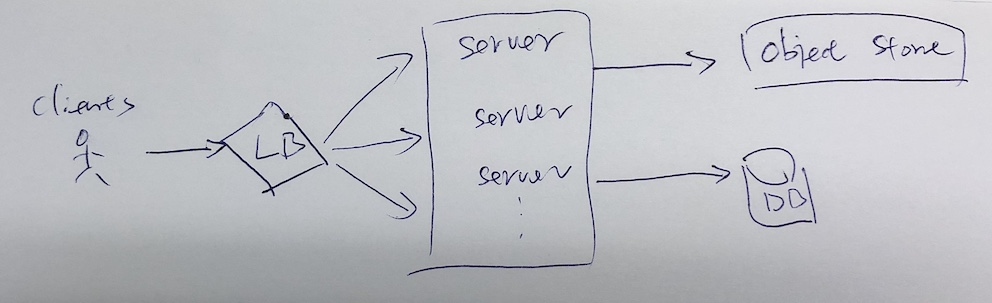
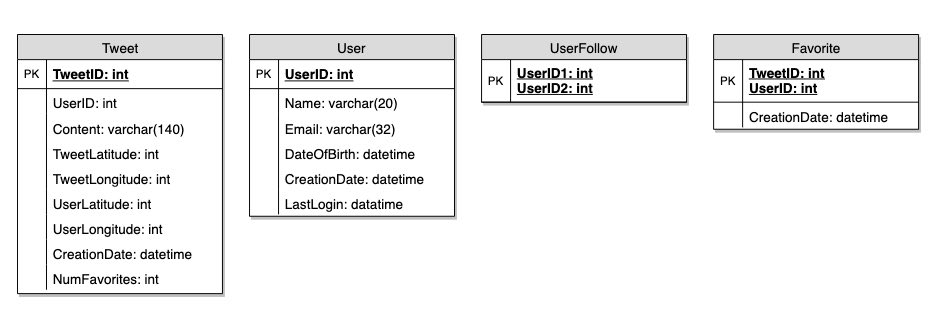
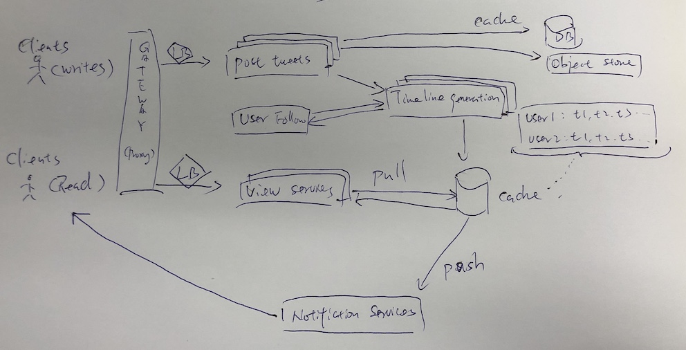

# Twitter

## 明确需求
- 功能性需求
    - 用户可以发Tweets
    - 用户可以follow 其他用户
    - 可以收藏Tweets
    - create and display user‘s timeline
    - Tweets 可以包含图片或视频

- 非功能性需求
    - 高可用性
    - 生成 timeline， 200ms 延迟可接受
    - 一致性可能会受到影响（为了可用性）；如果用户有一阵子没有看到推文，那应该没问题。能保证最终一致性就好

- 扩展需求
    - 搜索Tweets
    - 回复Tweets
    - Hot Topices or Searches
    - Tagging users
    - Tweet 通知
    - Who to follow？ Suggestions

## 估算和约束

    假设有1B total users and 200M DAU， 每天有100M new tweets，每个用户follow 200个人

    每个用户每天收藏5篇tweets： 200M * 5 = 1B/day 

    每天生成多少时间轴：每个用户看自己两次。看别人5次。每个时间轴每页展示20个tweets。 200M * (2+5) * 20 tweets =28B/day 

    QPS Read：28B/(24*3600) = 325K/s

    QPS Write：100M/(24*3600) = 1151/s
    
- 存储估算：

    1 characters = 2 bytes。每篇tweets 140 characters = 280bytes。再加上30 bytes，记录meatadata

    一共是100M * (280*30) = 30GB/day

    假设每5篇tweets有图片，每行图片平均200KB， 每10篇tweets有视频，每个视频平均2MB

    100M/5 * 200KB + 100M/10 * 2MB = ～24TB/day

- 带宽估算

    每天一共有28B tweets被浏览，

    - text: 28B * 280bytes / (24*3600) = 93MB/s
    - phot: 28B/5 * 200KB / (24*3600) = 13GB/s
    - video: 28B/10 * 2MB/ (24*3600) = 22GB/s
    
    一共 ～35GB/s

## System API
    Post a new Tweet
    request: Tweet(api_dev_key, tweet_datat, tweet_location, user_location, media_ids)

    response: return URL or http error

## High Level System Design

## DB Design

由于Read-heavy，可利用NoSQL 扩展性好的优势，使用Key-Value pair DB or Column-oriented DB

Key-Value DB like Redis： {Key: TweetID, Val: {content, userID, latitude, longitude..... }}

Column-oriented DB like HBase: {Key: userID, Val: {TweetID, TweetID, TweetID, TweetID..}}

## Data Sharding

- Sharding based on UserID
    - 优点，查找某一个user的Tweets，只需要去一个shards找
    - 但如果没有个User特别火，大量的query会涌入一个server，

- Sharding based on TweetID
    - 优点： 解决了某个user特别火的问题
    - 但每次生成user Timeline 要查询所有shards server， 性能不高，但可用Cache优化

- Sharding based on Tweet creation time
    - 解决了 top tweets 的问题，查找很少的server，取出某个时间段Top 的tweets
    - 但是流量分布不均，因为在某个时间段，所有Tweets 的写入操作都会涌入到一个shard server

- Combine TweetID and Tweet creation time
    - Use epoch time - 从1970开始经过的秒数
    - New TweetID = 31 bits for epoch seconds + 17 bits for auto incrementing sequence
    - 17 bits 就是说2^17  = 130K, 每秒可以存储130K个new tweets
    - New TweetID Sample：
        - 1483228800 000001
        - 1483228800 000002
        - 1483228800 000003
        - 1483228800 000004
    - 我们仍然必须查询所有服务器以生成timeline，但是我们的读取（和写入）速度会大大提高。
        - 写入，无需在Creation time 创建索引，会减少延迟
        - 读取，不需要过滤Creation time，因为TweetID (主键)中包含Epoch time，生成timeline时直接按TweetID排序

## Cache

- 我们可以用Redis or Memcache缓存Hot Tweets
- LRU
- 缓存过去3天20%的Tweets for each shard

## Timeline Generation

参考Instagram news feed

## Monitoring

- 每天/每秒的new tweets， daily peak 是多少
- Timelie delivery，每天/每秒显示多少Tweets
- 用户刷新timeline的平均延迟

## Final Design

